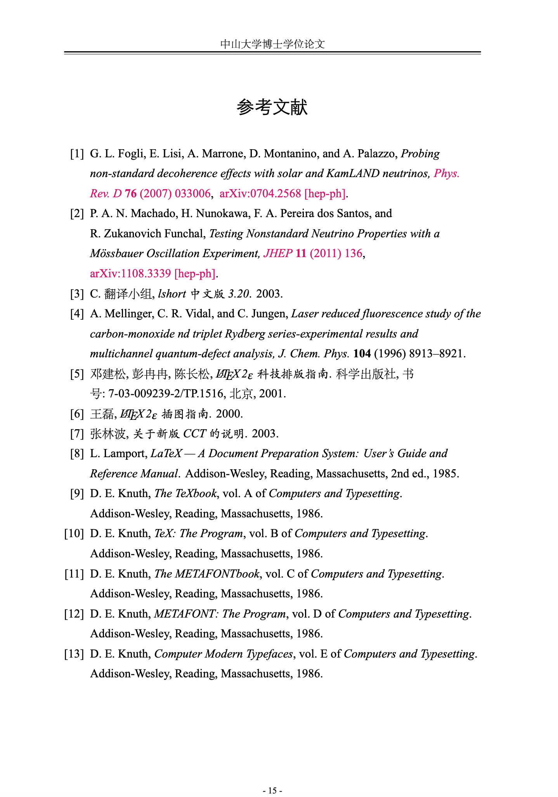
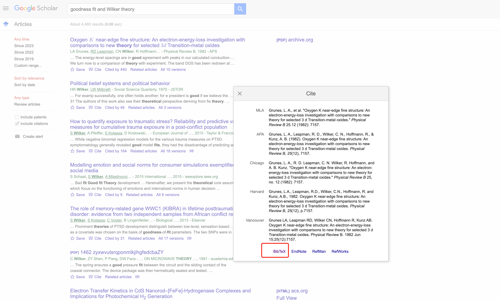

# SYSU_thesis_template
基于网络上流传的中科大学生制作的毕业论文模版修改而来。本版本符合中山大学论文排版规范，可用作中山大学博士、硕士和本科生毕业论文和毕业设计。特点是排序美观，布局清楚和模块化，参考文献格式完美（可自动内嵌arxiv和doi超级链接），章节内标题，表题和图题等超级链接皆全等特点。已经助力多个博士生和硕士生毕业。

你如果你喜欢本项目，请给一个免费的star&bigstar;，谢谢！
# 鸣谢
这个版本起初只是本人自用，后师弟、妹们和朋友们觉得效果不错并求分享，所以现在将其开源到github上，希望对大家有所帮助。由于本模板是在前人的基础上修改而来，所以在此对原作者表示感谢。但原始链接暂时找不到，但经过内嵌信息可知最初可能是由[ywgATustcbbs](https://github.com/ywgATustcbbs/ustcthesis)创立。另外。本模板中致谢部分也未做修改，以表示对原创的尊重。
# 效果
除了题前已经提及的特点之外，本模板还有以下特点：
+ 正文效果：
  
其中奇数面显示“中山大学博士学位论文”（需要修改为硕士或本科的朋友，可在主文件[elphen_phd_thesis.tex](中大研究生毕业论文模板--ElphenWang修改20231114/elphen_phd_thesis.tex)中\documentclass[doctor]改为master或bachelor），偶数面显示大章节名称。参考文献的数字用蓝色字体显示，且自动内嵌到参考文献的位置。
**注意**：编译就编译主文件就可以，但当有新参考文献添加到[tex.bib](中大研究生毕业论文模板--ElphenWang修改20231114/bib/tex.bib)文件中时，先按BibTex编译，将新参考文献文件形成，再按XeLaTeX编译即可。

+ 参考文献：
  
  其中红色字体代表有超级链接。点击杂志简称的超级链接会跳转到doi对应的网址，点击arxiv的超级链接会跳转到arxiv对应的网址。
**注意**：虽然字体颜色花哨，但没有问题，中大目前对此没有异议。如有特殊需求的，可自行到[sysuthesis.cls](中大研究生毕业论文模板--ElphenWang修改20231114/sysuthesis.cls)自行修改。
  参考文献的格式选取的是bibtex格式，大家插入自己的参考文献时需注意，也可以直接在谷歌学术中直接拷贝黏贴到tex.bib文件中。
  

```
  @article{grunes1982oxygen,
  title={Oxygen K near-edge fine structure: An electron-energy-loss investigation with comparisons to new theory for selected 3 d Transition-metal oxides},
  author={Grunes, LA and Leapman, RD and Wilker, CN and Hoffmann, R and Kunz, AB},
  journal={Physical Review B},
  volume={25},
  number={12},
  pages={7157},
  year={1982},
  publisher={APS}
}
```

+ 其他效果
 其他效果暂时就不细细详述了，大家可自行直接在[elphen_phd_thesis.pdf](中大研究生毕业论文模板--ElphenWang修改20231114/elphen_phd_thesis.pdf)中查看。

 # Star历史


